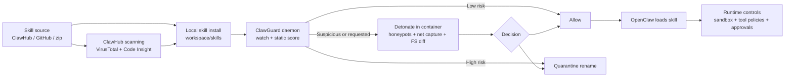

# Skill Protection for OpenClaw and How ClawGuard Compares

## Executive summary

The OpenClaw “skills” ecosystem is effectively a software supply chain where the unit of distribution is *instructional Markdown plus optional scripts and resources*. Official OpenClaw guidance explicitly treats third‑party skills as “untrusted code”, recommends reading them, and points users to sandboxing as a blast‑radius reduction measure. citeturn23view0turn4view10 In practice, real‑world incidents show that many malicious skills do not rely on obvious malware binaries inside the skill bundle; instead they weaponise the workflow (links, copy‑paste commands, staged downloads), which bypasses signature‑style scanning and even “safe tool” boundaries. citeturn27view0turn26view0turn25view0

Today’s protection landscape clusters into four layers:

- **Marketplace controls** (ClawHub moderation + VirusTotal/Code Insight scanning) that reduce exposure but can still miss social‑engineering and produce false positives. citeturn3view2turn5view0turn28view0  
- **Local pre‑install scanners** (ClawSkillShield, crabukit, security-audit-skill) that help users audit a skill package before enabling it, but are mostly static/pattern based and typically run only when invoked. citeturn13view2turn6view1turn16view0  
- **Runtime guardrails** (APort Agent Guardrails) that deterministically mediate tool execution via a platform hook, addressing prompt-injection bypass risk, but do not directly analyse the *skill artefact* at upload/install time. citeturn31view0turn30view4  
- **Hardening/monitoring suites** (SecureClaw, ClawSec, OpenClaw sandboxing) that improve overall instance security and integrity, yet are limited by the fact that sandboxing is optional and, historically, can be bypassed when policy enforcement diverges from runtime behaviour. citeturn34view3turn8view0turn24view0turn4view10

ClawGuard’s spec positions it as a **local, always‑on “interceptor”** that watches skill directories, performs **fast static scoring**, and—crucially—adds a **sandbox detonation** path with honeypot credentials, network capture, and memory-file diffing to observe *behaviour*, not just code patterns. fileciteturn0file0 This detonation concept is the clearest differentiator versus the mainstream “scan + warn” tools.

## ClawGuard baseline and interaction model

The provided ClawGuard one‑pager describes: a TypeScript/Node daemon distributed via npm, watching skill folders (inotify/FSEvents), scoring risk (0–100), quarantining by non‑destructive rename, and optionally detonating suspicious skills in a containerised environment with a dummy OpenClaw agent, honeypot secrets, network taps, filesystem monitoring (especially memory and identity files), and baseline diffs. fileciteturn0file0

Important gaps in the supplied spec (so comparisons below cannot assume them): **publisher‑side IP protection** (encryption/obfuscation/watermarking), **cryptographic provenance** (publisher signatures), **remote attestation/TEE‑style execution**, pricing, and explicit policy models beyond allow/block decisions. fileciteturn0file0

A concise view of how the strongest protection layers can compose:



This matters because OpenClaw’s own sandboxing “materially limits” access but is explicitly “not a perfect security boundary”, and external research has documented sandbox-policy mismatches and TOCTOU-style path issues—so a defence that relies on only one layer is brittle. citeturn4view10turn24view0

## Landscape map of current protection tools and approaches

**ClawHub security controls and marketplace scanning — OpenClaw project (Feb 2026 scanning rollout; service)**. ClawHub’s moderation layer requires a GitHub account age threshold and supports user reporting with auto-hiding after multiple unique reports. citeturn5view0 OpenClaw also announced that all skills published to ClawHub are scanned via entity["company","VirusTotal","threat intelligence platform"] (including Code Insight), with deterministic packaging, SHA‑256 hashing, auto-approval/flag/block logic, and daily re-scans. citeturn3view2 Strength: *ecosystem-scale* friction reduction and fast takedown. Limitation: scanning cannot reliably detect “the malware is the workflow” cases (where the bundle is clean but instructions cause remote execution), and false positives are observable in community reports. citeturn26view0turn28view0

**OpenClaw core controls — OpenClaw project (ongoing; OSS)**. Built-in sandboxing can run tools inside entity["company","Docker","container platform"] with configurable workspace mounts and modes (off/non-main/all). citeturn4view9turn4view10 Skill loading includes metadata-based gating (“requires bins/env/config”), plus explicit security notes to treat third‑party skills as untrusted code. citeturn23view0turn23view1 Strength: first-party, integrated, and broadly applicable. Limitation: optionality, complexity, and (per external findings) potential boundary gaps if policy enforcement drifts from runtime behaviour. citeturn24view0turn4view10

**SecureClaw — entity["company","Adversa AI","agentic ai security vendor"] (v2.0 Feb 13, 2026; MIT)**. Provides quick audit/hardening scripts, scans installed skills for dangerous patterns, checks exposure and configuration risks, and supports installation via ClawHub or scripts. citeturn34view3turn34view0turn4view0 Strength: practical “secure my deployment” workflow with broad coverage. Limitation: primarily auditing/hardening; not a behaviour‑detonation system, and still inherits the limits of static/pattern checks for social-engineered chains. citeturn34view3turn27view0

**ClawSkillShield — community (initial public commit Feb 6, 2026; MIT)**. A local-first Python scanner that detects risky imports/calls, secrets, obfuscation indicators, scores risk, and can quarantine a skill directory. citeturn13view2turn14view0 Strength: very low friction, offline, and explicitly pre-install focused. Limitation: mostly static heuristics; sophisticated staged payloads or delayed execution can evade “looks suspicious” rules without dynamic observation. citeturn13view2turn26view0

**crabukit + Clawdex — community + entity["company","Koi","security research company"] (crabukit Feb 2026; MIT; Clawdex service date not stated)**. crabukit scans skills for prompt injection attempts, secrets, code vulnerabilities, and supply-chain indicators; it can be used as a safe-install wrapper and optionally integrates Clawdex as a known-bad database check. citeturn6view1turn8view4turn17view0 Clawdex exposes an API returning {benign|malicious|unknown} verdicts and can be installed as a skill for automated checks. citeturn7view0 Strength: “defence in depth” around known-malicious inventories plus heuristic analysis. Limitation: unclear guarantees and (without detonation) limited visibility into runtime behaviour and “workflow malware”. citeturn26view0turn6view1

**ClawSec — entity["company","Prompt Security","agent security vendor"] and entity["company","SentinelOne","cybersecurity company"] (date not explicit in repo excerpt; AGPLv3+)**. A suite focused on integrity and drift detection for critical agent files (SOUL/IDENTITY etc.), checksum verification, health checks, and advisory monitoring. citeturn8view0turn4view3 Strength: mitigates “cognitive architecture” tampering and persistence via file drift. Limitation: it’s not primarily a skill-upload protection gate; it strengthens integrity after install but does not inherently evaluate whether a newly downloaded skill’s workflow is malicious. citeturn8view0turn26view0

**APort Agent Guardrails — entity["company","APort","agent guardrails vendor"] (Feb 19, 2026+ releases; Apache 2.0 open-core)**. Implements deterministic pre-action authorisation by running in OpenClaw’s `before_tool_call` hook, so the model cannot skip enforcement; supports local or API evaluation. citeturn31view0turn32view0turn30view4 Strength: strong runtime guarantees against prompt-injection “skip the safety step” bypass. Limitation: it does not replace artefact-level inspection; a malicious skill can still attempt to social-engineer a human outside tool hooks. citeturn27view0turn31view0

**ClawShield attestation — community (Feb 2026; licence not stated)**. Generates commit-bound audit output and anchors proofs on-chain (opBNB testnet), aiming at provenance and tamper-evidence. citeturn18view0turn19view0 Strength: integrity/provenance signalling. Limitation: attestation is not confidentiality; it does not stop the “workflow is malware” pattern or protect against benign-but-dangerous instructions unless your audit rules catch it. citeturn26view0turn18view2

## Comparative table of key attributes

| Solution | Protection techniques | Integration effort | Performance impact | Security guarantee | Bypass risk | Cost/licensing | Adoption signal |
|---|---|---:|---:|---|---|---|---|
| ClawHub + VirusTotal/Code Insight citeturn3view2turn5view0 | Marketplace scanning, hashing, rescans, moderation | None (server-side) | None locally | Medium (best-effort) | Medium–High (workflow malware, FPs) citeturn26view0turn28view0 | Service; OSS ecosystem | High (default path) |
| OpenClaw sandboxing + skill gating citeturn4view10turn23view1 | Sandboxing, allow/deny via policies, gating via metadata | Medium (config) | Medium (containers) | Low–Medium (explicitly imperfect) citeturn4view10turn24view0 | Medium | OSS | High (core feature) |
| SecureClaw citeturn34view3turn34view0 | Audits, hardening, pattern scans, integrity baselines | Low–Medium | Low | Medium for config drift | Medium | MIT | Medium (GitHub stars) citeturn34view0 |
| ClawSkillShield citeturn13view2turn14view0 | Static heuristics + quarantine | Low | Low | Low–Medium | High vs staged payloads | MIT | Medium (community visibility) |
| crabukit + Clawdex citeturn6view1turn7view0 | Static analysis + known-bad DB | Low–Medium | Low | Medium for known-bad | Medium | MIT + service (Clawdex) | Early-stage |
| ClawSec citeturn8view0turn4view3 | Integrity monitoring, signed checksums, advisory feed | Medium | Low | Medium for drift/persistence | Medium | AGPL | Early–Medium |
| APort Guardrails citeturn31view0turn30view4 | Runtime authorisation, policy, audit logs | Medium | Low–Medium | High for tool-call mediation | Low for tool bypass; higher for human social engineering citeturn27view0 | Apache 2.0 + paid cloud | Early but growing |
| ClawGuard fileciteturn0file0 | Always-on intercept, static score, detonation sandbox, quarantine | Medium | Low (static) + Medium (detonation) | Medium–High if detonation is robust | Medium (sandbox detection, delayed payloads) | MIT (per spec) | Pre-launch |

## Gaps and opportunities for ClawGuard

Most solutions either (a) **scan text/code**, or (b) **govern runtime tool calls**, or (c) **shift security left at the marketplace**. Few combine *continuous* local interception with *behavioural* evidence capture. That matters because incident writeups emphasise skills that manipulate agents and users into executing external installers and staged payloads—cases where “the zip is clean” but the workflow is not. citeturn26view0turn25view0turn27view0

ClawGuard’s “detonate suspicious skills with realistic honeypots + network capture + memory diffs” could become the first widely used *local emulator* for skill behaviour across arbitrary install paths (ClawHub CLI, manual zip, chat link). fileciteturn0file0 A second differentiation path is bridging **artefact trust** (hashes/signatures/attestation) and **execution trust** (policy hooks): ClawGuard can complement APort-style hooks rather than compete—ClawGuard decides “should this skill be present”, while runtime guardrails decide “should this tool call run now”. citeturn31view0turn30view4

Finally, if your real product goal includes *protecting skill authors’ IP*, the current ecosystem largely does not address that: skills are readable bundles by design (and many attacks exploit that text). citeturn27view0turn23view0 True confidentiality would require a different distribution/execution model (remote services, TEEs, or contractual controls), which is not in ClawGuard’s current spec. fileciteturn0file0

## Recommended priority features and technical risks

Priority features (opinionated, assuming you want maximum real-world security impact quickly):

1. **Always-on local interception with clear quarantine semantics** (already core): leverage OpenClaw’s predictable skill loading and watcher behaviour so suspicious folders never become eligible. citeturn23view0turn22view0turn5view0  
2. **Detonation MVP focused on the dominant abuse pattern**: detect outbound fetch + execution chains and suspicious “setup” instructions, because multiple reports show staged installers as the primary payload delivery mechanism. citeturn26view0turn25view0turn27view0  
3. **Evidence-grade reporting**: “what it tried to read”, “where it connected”, “did it modify memory/identity files”, written in plain language (your spec explicitly calls readability a success factor). fileciteturn0file0  
4. **Interoperability with marketplace signals**: ingest ClawHub/VirusTotal hashes/verdicts when available (fast known-bad), but do not treat “0 detections” as clean (documented false-positive/mismatch dynamics go both ways). citeturn3view2turn28view0turn26view0  
5. **Optional runtime hook roadmap**: do not rebuild APort, but offer a “recommended pairing” mode or a lightweight native policy hook if OpenClaw exposes stable plugin interfaces—because deterministic runtime mediation is the only robust answer to prompt injection bypass at the tool layer. citeturn31view0turn24view0

Key technical risks to manage explicitly:

- **Sandbox detection / “plays nice in the lab”**: your own spec flags this; real campaigns can fingerprint environments and delay. Mitigation is realism, randomisation, and repeated behavioural prompts. fileciteturn0file0  
- **Over-reliance on containers as a boundary**: OpenClaw itself cautions sandboxing is not perfect, and external research highlights policy/implementation gaps. Treat detonation as *risk-reduction*, not proof of safety. citeturn4view10turn24view0  
- **False positives and user churn**: ClawHub issues show how “suspicious” labelling can frustrate benign publishers; ClawGuard needs explainability and override flows to avoid becoming uninstall-ware. citeturn28view0turn28view1turn0file0

## Source links

```text
https://openclaw.ai/blog/virustotal-partnership
https://docs.openclaw.ai/tools/clawhub
https://docs.openclaw.ai/tools/skills
https://docs.openclaw.ai/gateway/sandboxing
https://blog.virustotal.com/2026/02/from-automation-to-infection-how.html
https://www.trendmicro.com/en_us/research/26/b/openclaw-skills-used-to-distribute-atomic-macos-stealer.html
https://labs.snyk.io/resources/bypass-openclaw-security-sandbox/
https://github.com/adversa-ai/secureclaw
https://github.com/AbYousef739/clawskillshield
https://github.com/tnbradley/crabukit
https://clawdex.koi.security/
https://github.com/prompt-security/clawsec
https://github.com/aporthq/aport-agent-guardrails
```